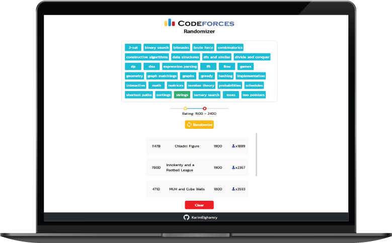

# Codeforces Randomizer

Built using React, Styled Componenents and Typescript.

deployed at: https://karimelghamry.github.io/Codeforces-Randomizer/

### Show some :heart: and :star: the repo to support the project

## How it works

- Select topics from the provided list (max 4).

- Adjust the range of ratings to your likings.

- Press `Randomize` to retrieve a random problem from Codeforces based on your inputs.

 
 

 

## Features

[✓] Ratings adjustment

[✓] All current Codeforces topics included

[✓] Automatically saves history local storage

[✓] Clear history on demand

## Contribution

Feel free to to suggest further features/improvements by opening an issue or by submitting a pull request.
